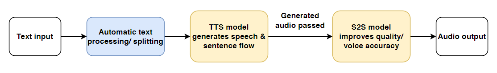

# Taha's Log: Python AI Voice Cloning

## Brief

Hi there! This is a repository on using and training **machine learning models for speech synthesis** using Python, in particular for voice cloning.

I hope to use this repo to share some of my Python scripts and the results, and log my progress implementing new processes and improving output quality.

The intention behind this study is that it ultimately contributes to another project of mine, where I hope to implement some of these features alongside many others in a unified solution: a locally run TTS Narrator tool that allows for custom voices and actual high quality speech generation. This project can be found at [RanniGPT](https://github.com/TahaDidIt/RanniGPT).

## Considerations

I think that it goes without saying, but the use of AI tools comes with ethical considerations. I really believe in the potential for these tools to benefit people, but I'm also an advocate for their proper usage.

As such: who's voice you train a model on, what you use that for, and whether you share that content online (publicly) are important things to think about.

This repo exists for learning purposes, and I hope that it can help someone learn how they can work with these tools for themselves. But I won't share audio datasets for training and especially the trained voice models themselves. I will include some generated speech audio to demonstrate results and any reference audio that was used for them, which may be based on a fictional character or personality- that's just what I chose to have fun with within my personal educational usage. If you clone a voice that isn't yours, I'd implore you to also be thoughtful about sharing this content online.

### Motivations - A boring story
The motivation behind this study stems from 2 main reasons.
1. I love building things, and I'm fascinated by Data and Machine Learning.
2. It can sometimes be difficult for me to follow long blocks of text when it comes to reading books, university work, or just learning new things all the time as I love doing. Having long-form text be narrated has been a great tool for me in the last few years, and helped me stick with textbooks, papers, and even long ChatGPT explanations (lol).

    Having someone like a favourite character narrate this also worked annoyingly well at helping me engage. The solutions currently out there however are either low quality, come at a price, or lack features I'd like. So I set out to make a simple tool, with my own user experience and accessibility in mind.

# Results

[Work in Progress]

The major aim of this work is to create a robust "pipeline" for voice generation by pairing together a Text-to-Speech (TTS) and Speech-to-Speech (S2S) model to create optimal generation quality both in terms of smoothness/reliability and likeness to original voice.

## 1 - RVC training

# Acknowledgements

[Work in Progress]

